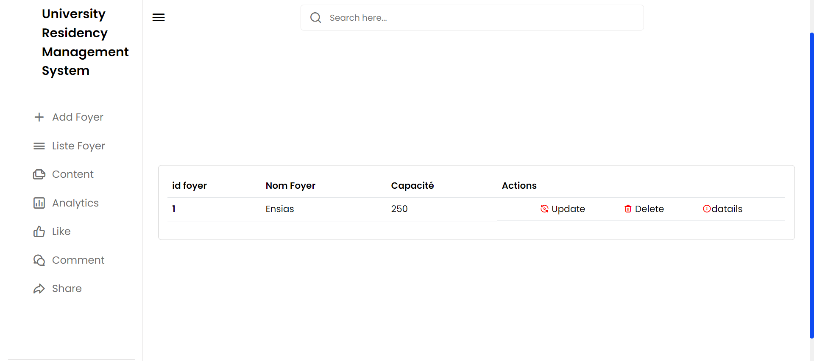

# University Accommodation Management System using Angular 15, Spring Boot  3.1.4, MYSQL, Hibernate JPA

## Project Structure

This project was generated with Angular CLI version 15.2.9. It follows a standard full-stack architecture with separate folders for the server (Spring Boot) and frontend (Angular).
### Overview

### Server

The server-side code, implemented in Spring Boot, is organized as follows:

- **src/main/java/com/server:**
  - `controller/`: Contains controllers for handling HTTP requests.
  - `service/`: Houses business logic and services.
  - `model/`: Defines data models.
  - `repository/`: Manages data access and storage.
  - `Application.java`: Main class to run the Spring Boot application.

- **src/main/resources:**
  - `application.properties`: Configuration file for the Spring Boot application.

### Frontend

The client-side code, developed using Angular, is structured as follows:

- **src/app:**
  - `components/`: Contains Angular components.
  - `services/`: Houses Angular services.

- **src/assets:** Contains static assets used in the application.

- **angular.json:** Angular configuration file.

- **tsconfig.json:** TypeScript configuration file.

## Getting Started

### Prerequisites

Ensure you have the following installed:

- Node.js: [Download and Install Node.js](https://nodejs.org/)
- Angular CLI: Install globally using `npm install -g @angular/cli`

### Running the SpringBoot Development Server

1. Navigate to the server folder (`University Accommodation Management System /server`).
2. Run the Spring Boot application.
   ```bash
   ./mvnw spring-boot:run

### Running Angular Development Server

1. Open a new terminal window, navigate to the frontend folder (University Accommodation Management System/frontend), and run the Angular development server.

2. ng serve
Open your web browser and go to http://localhost:4200/ to view the application.
3. Build Angular project : ng build
